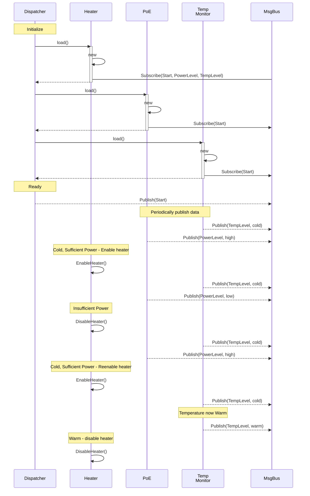

# Introduction

The purpose of this project is to demonstrate how using a message dispatcher
(i.e. MQTT) and loadable modules (i.e. DLLs or shared libraries) keeps the
system loosely-coupled and easily configurable.

This project uses the concept of multiple types of security cameras all sharing
the same code base but each with a different set of features. Each type of
camera is composed of components (i.e. lens, motors, heaters, power source)
that need to communicate with other components but the communication is kept
loosely-coupled using the publish-subscribe pattern.

For example,
- **Outdoor Cameras** use heaters to keep the motors warm and lenses defogged.
- **Indoor Cameras** don't need heaters but have fans to keep the cameras from
  overheating.

The different camera models run the same software and use a configuration file
to determine which modules to load (which can have their own configuration
settings).

The same module (i.e. heater) can be used multiple times with different
configurations. For example, a camera may have multiple heaters in different
locations and would need to be controlled separately.

By using the Publish-Subscribe model, modules are kept loosely-coupled and
allow modules to be added or removed without requiring changes to the core
system.

As new camera models are created, it may be possible to reuse existing modules
with only configuration changes such as changing the UART address. It would
also allow new and/or experimental modules to be created and deployed to the
field.

## Visualization of Message Dispatch System

This sequence diagram is showing startup and heater control.

## Camera Simulator

This project uses **ncurses** to visualize camera components and the
interactions between the components. It uses the **mosquitto** MQTT broker
for the publish-subscribe communications.

Real cameras read and write to the serial ports to communicate with MCUs or
lens modules. I tried using pseudo-terminals (see `pts(4)`) to more closely
mimic a real camera but I couldn't get it working - it kept crashing on me.

### Possible Future Upgrades

- Get pts working so as to be able to use this simulator instead of using a
  real camera for testing.
- Use a 360 degree camera feed and display a "normal" stream using Qt. I don't
  know if this is possible. Then, as the user pans and tilts, the image
  pans/tilts within the 360 degree feed.
- Perform object detection within the stream.
- Use _ptmx, pts - pseudoterminal master and slave_ to simulate an MCU.
  - Delays can be added to responses to simulate specific models of cameras.

# CMake References

[The Ultimate Guide to Modern CMake](https://rix0r.nl/blog/2015/08/13/cmake-guide/)
[Generated Sources in CMake Builds](https://crascit.com/2017/04/18/generated-sources-in-cmake-builds/)

# Dependencies

## _Zero Communications and Marshalling_ ([ZeroCM/zcm](https://github.com/ZeroCM/zcm))

This library is _not_ built using CMake but instead uses `waf`. It is easy
enough to compile, but it would be cool if it could be built using only CMake.

## [gabime/spdlog](https://github.com/gabime/spdlog)

This is a fast, header-only, C++11 logging library.

This library is easily built with CMake.
