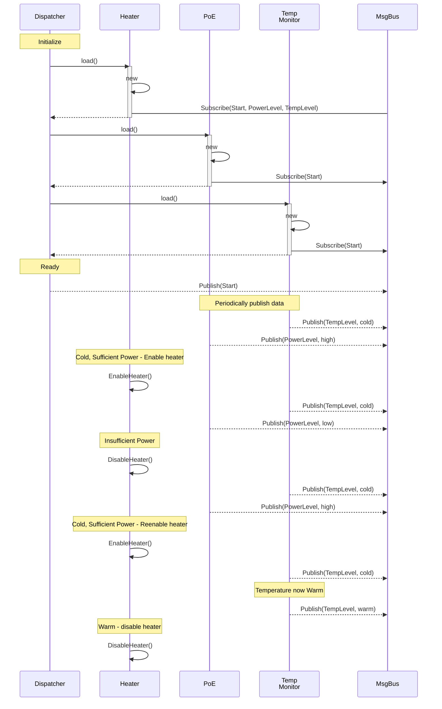
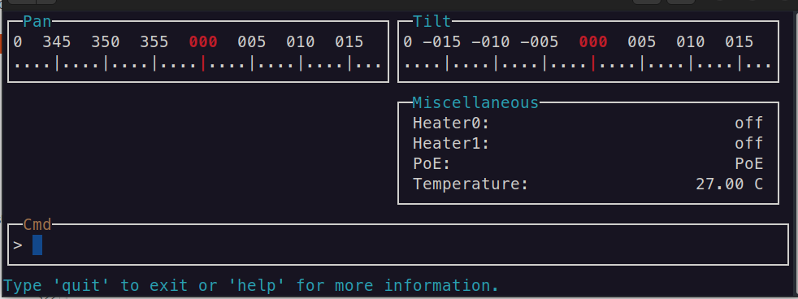

# Introduction

The purpose of this project is to demonstrate how using a message dispatcher
(i.e. MQTT) and loadable modules (i.e. DLLs or shared libraries) keeps the
system loosely-coupled and easily configurable.

This project uses the concept of multiple types of security cameras all sharing
the same code base but each with a different set of features. Each type of
camera is composed of components (i.e. lens, motors, heaters, power source)
that need to communicate with other components but the communication is kept
loosely-coupled using the publish-subscribe pattern.

For example,
- **Outdoor Cameras** use heaters to keep the motors warm and lenses defogged.
- **Indoor Cameras** don't need heaters but have fans to keep the cameras from
  overheating.

The different camera models run the same software and use a configuration file
to determine which modules to load (which can have their own configuration
settings).

The same module (i.e. heater) can be used multiple times with different
configurations. For example, a camera may have multiple heaters in different
locations and would need to be controlled separately.

By using the Publish-Subscribe model, modules are kept loosely-coupled and
allow modules to be added or removed without requiring changes to the core
system.

As new camera models are created, it may be possible to reuse existing modules
with only configuration changes such as changing the UART address. It would
also allow new and/or experimental modules to be created and deployed to the
field.

## Visualization of Message Dispatch System

This sequence diagram is showing startup and heater control.

## Camera Simulator

This project uses **ncurses** to visualize camera components and the
interactions between the components. It uses the **mosquitto** MQTT broker
for the publish-subscribe communications.

Real cameras read and write to the serial ports to communicate with MCUs or
lens modules. I tried using pseudo-terminals (see `pts(4)`) to more closely
mimic a real camera but I couldn't get it working - it kept crashing on me.

### Possible Future Upgrades

- Get pts working so as to be able to use this simulator instead of using a
  real camera for testing.
- Use a 360 degree camera feed and display a "normal" stream using Qt. I don't
  know if this is possible. Then, as the user pans and tilts, the image
  pans/tilts within the 360 degree feed.
- Perform object detection within the stream.
- Use _ptmx, pts - pseudoterminal master and slave_ to simulate an MCU.
  - Delays can be added to responses to simulate specific models of cameras.

# CMake References

[The Ultimate Guide to Modern CMake](https://rix0r.nl/blog/2015/08/13/cmake-guide/)
[Generated Sources in CMake Builds](https://crascit.com/2017/04/18/generated-sources-in-cmake-builds/)

# Dependencies

## _Zero Communications and Marshalling_ ([ZeroCM/zcm](https://github.com/ZeroCM/zcm))

This library is _not_ built using CMake but instead uses `waf`. It is easy
enough to compile, but it would be cool if it could be built using only CMake.

## [gabime/spdlog](https://github.com/gabime/spdlog)

This is a fast, header-only, C++11 logging library.

This library is easily built with CMake.

# Project Status

- Building on Ubuntu 24.04, using:
  - clang (C++20 - but with minimal changes work with C++17)
  - cmake
  - ncurses and panel
  - spdlog 
  - mosquitto MQTT broker
  - nlohmann json
  - ...
- Currently have two plugins working (Heater and TempMonitor).
- Code was first written using keyboard control to get ncurses/panel working.
- "Cmd" interface only supports a few commands (e.g. "quit").

## History

The ncurses/panel windows originally were controlled via the keyboard (pan
up/down, tilt left/right, zoom in/out, etc.) just to get the ncurses windows
working correctly.

Once that was working, a new "command" window was added to be able to send
more advanced commands like "PanTo <pos>", "PanBy <steps>", etc. but still
just updating ncurses windows.

Implemented a different program to implement two plugins to get them loaded
as plugins and communicating via MQTT messaging.

Merged the ncurses and MQTT code together and currently loading the plugins
via main() rather than from a configuration file.

The ncurses interface does update based on received MQTT messages but more
work is needed as additional plugins are added.

Replaced custom logging with spdlog to have improved logging output and send
output to multiple sinks (stdout, udp, file) which helped with debugging.

## Next Steps

[ ] Add motor plugin(s) to control pan, tilt, and zoom.
[ ] The cmd window shouldn't talk directly to the other windows, but rather it
    should send messages to the "camera" (i.e. plugins) and the visual
    interface (i.e. other windows) should only be updated when a message is
    received from a plugin.
[ ] Implement plugin configuration via a configuration file. Initially use
    nlohmann json library. Perhaps another format would be more appropriate.
[ ] Build it on Windows 11.
[ ] Build it on MacOS.
[ ] Use Qt (or CopperSpice) to build a GUI. Maybe there are already existing
    pan/tilt gauges.

## Grand Ideas

### ONVIF Plugin (convert SOAP to JSONRPC)

Currently JSON is used as the MQTT payloads. This makes it easy to read and
keeps the messages generic as they are broadcasted to listening peers rather
than directed to a specific component.

I was thinking that JSONRPC support could also be added to allow components to
with each other using a more structured request/response model with known
message bodies. (See JsonRpcCXX)[https://github.com/jsonrpcx/json-rpc-cxx.git]

Using that, an ONVIF plugin could be added that converts SOAP messages into
JSONRPC messages. This way messages coming into the system via ONVIF would
immediately be shared with any listening component. If a message is not
understood, a default response would be sent after a short timeout. Perhaps
components could register with the ONVIF plugin to indicate which messages are
supported rather than relying solely on the timeout.

The ONVIF plugin would take sometime to get working (start with core
specification before implementing other profiles). But once it is compiled,
it would be generic and useable by lots of different projects. Perhaps even
creating a pipeline to convert from JSONRPC to some other protocol.

### Qt (or CopperSpice)

You can only do so much with a text-base UI (TUI).

#### 360° Video

Load and play a 360° video and allow pan/tilt controls to reposition what part
of the video is showing.
